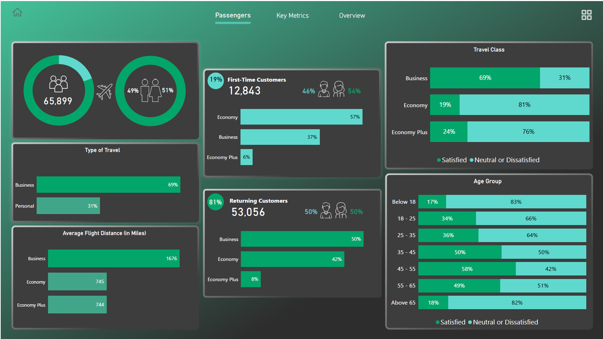
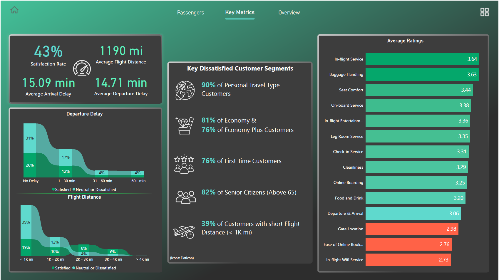
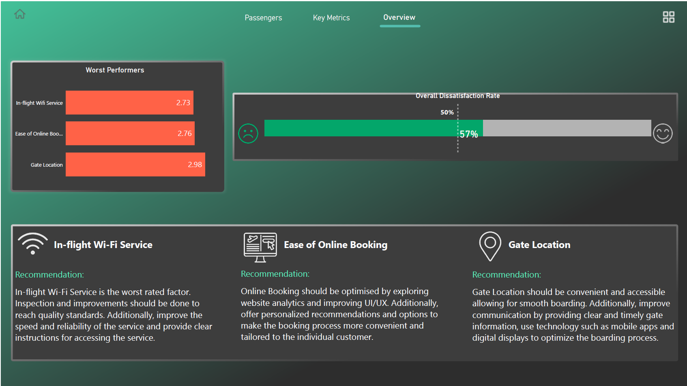

# ✈️ Airline Passenger Satisfaction Analysis Dashboard

## 📌 Project Overview

Analyzed 130K+ airline passengers → **Found 43% satisfied, 57% dissatisfied**
→ Identified WiFi & Booking as biggest pain points → Built Power BI dashboard with actionable recommendations

The dashboard provides actionable insights into passenger behavior, travel preferences, service ratings, flight delays, and dissatisfaction drivers, helping airlines make data-driven decisions to improve customer satisfaction.

---

## 🎯 Business Problem

Airlines collect large volumes of customer feedback and operational data, but identifying the factors that drive passenger satisfaction can be challenging.

This project aims to:

* Measure overall passenger satisfaction.
* Identify dissatisfied customer segments.
* Analyze the impact of travel class, customer type, age group, and flight distance.
* Evaluate airline service ratings.
* Recommend improvements for low-performing services.

---

## 🛠️ Tools & Technologies

* Power BI Desktop
* Python (Data Cleaning & Preprocessing)
* Pandas
* NumPy
* Jupyter Notebook
* Data Visualization


---

## 📊 Dashboard Pages

### 1️⃣ Passenger Overview

Analyzes:

* Customer Type (First-Time vs Returning)
* Travel Type (Business vs Personal)
* Travel Class Distribution
* Age Group Analysis
* Average Flight Distance

### 2️⃣ Key Metrics Analysis

Tracks:

* Satisfaction Rate
* Arrival Delay
* Departure Delay
* Average Flight Distance
* Service Ratings

Highlights:

* Most dissatisfied customer groups
* Impact of flight delays on satisfaction
* Effect of flight distance on customer experience

### 3️⃣ Executive Summary & Recommendations

Identifies:

* Worst-performing service categories
* Overall dissatisfaction rate
* Business recommendations for service improvement

---

## 📈 Key Insights

### Customer Satisfaction

* Overall Satisfaction Rate: **43%**
* Overall Dissatisfaction Rate: **57%**

### Travel Type

* Business Travelers show significantly higher satisfaction than Personal Travelers.

### Customer Type

* Returning customers are more satisfied compared to first-time customers.

### Age Group

* Passengers aged **45–55 years** exhibit the highest satisfaction levels.

### Flight Distance

* Short-distance passengers (<1000 miles) contribute heavily to dissatisfaction.

### Service Ratings

Top Rated Services:

* In-flight Service
* Baggage Handling
* Seat Comfort

Lowest Rated Services:

* In-flight WiFi Service
* Ease of Online Booking
* Gate Location

---

## 💡 Recommendations

### Improve In-Flight WiFi

* Increase connection reliability.
* Improve internet speed.
* Provide easier onboarding instructions.

### Enhance Online Booking Experience

* Simplify UI/UX.
* Reduce booking friction.
* Offer personalized recommendations.

### Optimize Gate Management

* Improve gate communication.
* Provide real-time updates.
* Enhance boarding efficiency.

---

## 📂 Project Structure

```text
Airline-Passenger-Satisfaction/
│
├── Airline Passenger Satisfaction.pbix
├── Air-Line Passenger.ipynb
├── Airline-Passenger-Satisfaction-Analysis.pdf
├── Dataset/
│   └── airline_passenger_satisfaction.csv
│
├── Images/
│   ├── Dashboard_1.png
│   ├── Dashboard_2.png
│   └── Dashboard_3.png
│
└── README.md
```

---

## 🚀 How to Use

1. Clone the repository.
2. Open the `.pbix` file in Power BI Desktop.
3. Explore interactive dashboard pages.
4. Review insights and recommendations.

```bash
git clone (https://github.com/tanjeelmujawar/Airline-Passenger-Satisfaction-Analysis.git)
```

---

## 📷 Dashboard Preview

**Main Dashboard Overview:**


**Service Analysis Dashboard:**


**Recommendations Dashboard:**


---

## 👨‍💻 Author

**Tanjeel Mujawar**

Aspiring Data Analyst | Power BI | SQL | Python | Machine Learning

### Skills

* Power BI
* SQL
* Python
* Pandas
* Data Visualization
* Exploratory Data Analysis (EDA)
* Machine Learning

---

⭐ If you found this project useful, consider giving it a star.
